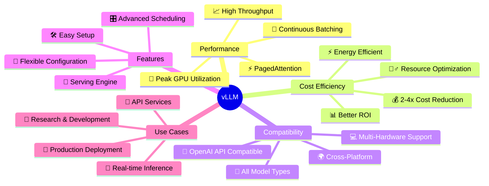

# Serving LLM through OpenAI-Compatible Server with vLLM

vLLM can be deployed as a server that implements the OpenAI API protocol. This allows vLLM to be used as a drop-in replacement for applications using OpenAI API. By default, it starts the server at http://localhost:8000. You can specify the address with --host and --port arguments. The server currently hosts one model at a time (OPT-125M in the command below) and implements list models, create chat completion, and create completion endpoints. 

## Why vLLM? Benefits & Advantages

vLLM is the **de facto serving solution** for open-source AI, providing unmatched performance and efficiency for LLM inference.

### 🚀 Key Benefits

- **🔥 High Throughput**: Maximize GPU utilization with PagedAttention technology
- **💰 Cost Efficient**: Slash inference costs by 2-4x compared to traditional methods
- **⚡ Lightning Fast**: Advanced scheduling and continuous batching ensure peak performance
- **🔧 Easy Integration**: Drop-in OpenAI-compatible API for seamless migration
- **🌐 Universal Compatibility**: Run any model on any hardware (CUDA, CPU, AMD, etc.)
- **📊 Production Ready**: Battle-tested by thousands of companies in production

### 🧠 vLLM Mind Map



### 📊 Performance Comparison

| Feature | Traditional LLM | vLLM | Improvement |
|--------|----------------|------|-------------|
| **Throughput** | Low | Very High | **3-5x** |
| **Memory Usage** | High | Optimized | **2-3x** |
| **GPU Utilization** | 60-70% | 90-95% | **+30%** |
| **Cost per Token** | High | Low | **50-75%** |
| **Setup Time** | Complex | Simple | **10 min** |

### 🎯 Who Uses vLLM?

- **Startups**: Cost-effective AI deployment
- **Enterprises**: Production-grade LLM serving
- **Researchers**: Fast experimentation and prototyping
- **Developers**: Easy integration with existing apps
- **ML Engineers**: Scalable inference pipelines

## Setup Instructions

### Prerequisites
- Python 3.10 or higher
- CUDA-compatible GPU (recommended) or CPU
- Conda package manager

### Step 1: Create and Activate Conda Environment
```bash
# Create a new conda environment with Python 3.10
conda create -n vllm-env python=3.10 -y

# Activate the environment
conda activate vllm-env
```

### Step 2: Select Python Interpreter
In your IDE (VS Code, PyCharm, etc.), select the newly created conda environment as your Python interpreter:
- **VS Code**: `Ctrl+Shift+P` → "Python: Select Interpreter" → Choose `vllm-env`
- **PyCharm**: Settings → Project → Python Interpreter → Add → Conda Environment → Existing → Select `vllm-env`

### Step 3: Install vLLM
```bash
# Install vLLM with CUDA support (recommended)
pip install vllm

# For CPU-only installation
pip install vllm --extra-index-url https://download.pytorch.org/whl/cpu
```

### Step 4: Start the Server
```bash
vllm serve facebook/opt-125m \
  --host 0.0.0.0 \
  --port 8000 \
  --gpu-memory-utilization 0.8 \
  --max-num-batched-tokens 8192
```

## Usage Approaches

Once you have vLLM set up, you have two main approaches to use it:

### 🌐 Approach 1: Server + Client (Recommended for Production)
Start the server in terminal, then use client scripts to communicate via API.

**Step 1:** Start the server (as shown above)
**Step 2:** Use client scripts like `vllm_inference/client_example.py`

```python
# client_example.py - Uses OpenAI-compatible API
from openai import OpenAI

client = OpenAI(
    base_url="http://localhost:8000/v1",
    api_key="token-abc123",  # Required but unused
)

response = client.chat.completions.create(
    model="facebook/opt-125m",
    messages=[{"role": "user", "content": "Hello!"}],
    max_tokens=50
)
print(response.choices[0].message.content)
```

**Benefits:**
- ✅ Multiple clients can connect simultaneously
- ✅ Language agnostic (Python, JavaScript, curl, etc.)
- ✅ Production-ready with load balancing
- ✅ Separate server and client processes

### 💻 Approach 2: Direct Python Usage (Recommended for Development)
Use vLLM directly in your Python code without starting a server.

```python
# facebook_inference.py - Direct vLLM usage
from vllm import LLM, SamplingParams

def main():
    prompt = "Hello, how are you?"
    sampling_params = SamplingParams(temperature=0.8, top_p=0.95)
    
    llm = LLM(model="facebook/opt-125m")
    outputs = llm.generate([prompt], sampling_params)
    
    for output in outputs:
        generated_text = output.outputs[0].text
        print(f"Generated: {generated_text}")

if __name__ == '__main__':
    main()
```

**Benefits:**
- ✅ Simpler setup (no server needed)
- ✅ Faster for single-process applications
- ✅ More control over vLLM parameters
- ✅ Better for experimentation and testing

### 🎯 Which Approach to Choose?

| Use Case | Recommended Approach | Why? |
|----------|-------------------|------|
| **Production APIs** | Server + Client | Multiple users, load balancing |
| **Web Applications** | Server + Client | Concurrent requests |
| **Research/Testing** | Direct Python | Faster iteration, more control |
| **Batch Processing** | Direct Python | Better resource utilization |
| **Microservices** | Server + Client | Service separation |

### Custom Chat Template
By default, the server uses a predefined chat template stored in the tokenizer. You can override this template by using the --chat-template argument:

```bash
vllm serve facebook/opt-125m --chat-template ./examples/template_chatml.jinja
```

## Query the Server

This server can be queried in the same format as OpenAI API.

### List Models
```bash
curl http://localhost:8000/v1/models
```

### Create Completion
```bash
curl http://localhost:8000/v1/completions \
  -H "Content-Type: application/json" \
  -d '{
    "model": "facebook/opt-125m",
    "prompt": "Hello, how are you?",
    "max_tokens": 50,
    "temperature": 0.8
  }'
```

### Create Chat Completion
```bash
curl http://localhost:8000/v1/chat/completions \
  -H "Content-Type: application/json" \
  -d '{
    "model": "facebook/opt-125m",
    "messages": [
      {"role": "system", "content": "You are a helpful assistant."},
      {"role": "user", "content": "Hello, how are you?"}
    ],
    "max_tokens": 50,
    "temperature": 0.8
  }'
```

## API Documentation

Access the interactive Swagger UI at:
```
http://localhost:8000/docs
```

Access the raw OpenAPI JSON spec at:
```
http://localhost:8000/openapi.json
```

## Additional Server Options

### Specify Host and Port
```bash
vllm serve facebook/opt-125m --host 0.0.0.0 --port 8080
```

### Enable Tensor Parallelism
```bash
vllm serve facebook/opt-125m --tensor-parallel-size 2
```

### Set GPU Memory Usage
```bash
vllm serve facebook/opt-125m --gpu-memory-utilization 0.8
```

### Use Quantization
```bash
vllm serve facebook/opt-125m --quantization awq
```


## Python Client Example

You can also use the OpenAI Python client to interact with the server:

```python
from openai import OpenAI

# Initialize the client
client = OpenAI(
    base_url="http://localhost:8000/v1",
    api_key="token-abc123",  # Required but unused
)

# Create a completion
completion = client.completions.create(
    model="facebook/opt-125m",
    prompt="Hello, how are you?",
    max_tokens=50,
    temperature=0.8
)

print(completion.choices[0].text)

# Create a chat completion
chat_completion = client.chat.completions.create(
    model="facebook/opt-125m",
    messages=[
        {"role": "system", "content": "You are a helpful assistant."},
        {"role": "user", "content": "Hello, how are you?"}
    ],
    max_tokens=50,
    temperature=0.8
)

print(chat_completion.choices[0].message.content)
```
## Direct Python Usage (Without Server)

If you want to use vLLM directly in Python without starting a server:

```python
from vllm import LLM, SamplingParams

def main():
    prompt = "Hello, how are you?"
    sampling_params = SamplingParams(temperature=0.8, top_p=0.95)

    llm = LLM(model="facebook/opt-125m")
    outputs = llm.generate([prompt], sampling_params)

    # Print the outputs
    for output in outputs:
        prompt = output.prompt
        generated_text = output.outputs[0].text
        print(f"Prompt: {prompt!r}, Generated text: {generated_text!r}")

if __name__ == '__main__':
    main()
```


## Production Deployment

### Using Screen
```bash
# Start server in background
screen -S vllm-server
vllm serve facebook/opt-125m --host 0.0.0.0 --port 8000

# Detach: Ctrl+A, D
# Reattach: screen -r vllm-server
```

### Using nohup
```bash
nohup vllm serve facebook/opt-125m --host 0.0.0.0 --port 8000 > vllm.log 2>&1 &
```

### Environment Variables
```bash
# Set GPU cache space
export VLLM_CPU_KVCACHE_SPACE=4  # in GB

# Disable logging
export VLLM_LOGGING_LEVEL=WARNING

# Start server
vllm serve facebook/opt-125m
```

## Troubleshooting

### Common Issues

**Out of Memory Error:**
```bash
# Reduce GPU memory usage
vllm serve facebook/opt-125m --gpu-memory-utilization 0.5

# Use quantization
vllm serve facebook/opt-125m --quantization awq

# Use smaller model
vllm serve distilgpt2
```

**Port Already in Use:**
```bash
# Use different port
vllm serve facebook/opt-125m --port 8080
```

**CUDA Out of Memory:**
```bash
# Use CPU mode
vllm serve facebook/opt-125m --device cpu

# Reduce batch size
vllm serve facebook/opt-125m --max-num-batched-tokens 1024
```

### Getting Help
```bash
# See all available options
vllm serve --help

# Check vLLM version
vllm --version
```

## Monitoring

### Health Checks
```bash
# Check if server is running
curl http://localhost:8000/health

# Check available models
curl http://localhost:8000/v1/models

# View server stats
curl http://localhost:8000/stats
```

## Quick Reference Commands

```bash
# Test completion
curl http://localhost:8000/v1/completions \
  -H "Content-Type: application/json" \
  -d '{"model": "facebook/opt-125m", "prompt": "Hello", "max_tokens": 10}'

# Test chat completion
curl http://localhost:8000/v1/chat/completions \
  -H "Content-Type: application/json" \
  -d '{"model": "facebook/opt-125m", "messages": [{"role": "user", "content": "Hello"}], "max_tokens": 10}'

# View docs
open http://localhost:8000/docs

# Health check
curl http://localhost:8000/health
```

This complete guide covers everything from basic setup to production deployment for serving LLMs with vLLM.
